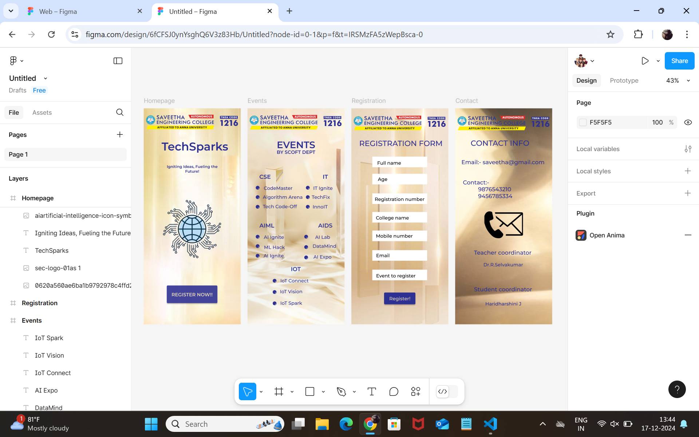

# Ex09 Event Registration Web Application
## Date:17/12/24

## AIM:
To design, develop and deploy a web application for event registration.

## DESIGN STEPS:

### Step 1:
Create a new frame.

### Step 2:
Select any one preset size of your choice.

### Step 3:
Select the shapes you need.

### Step 4:
Import images as needed.

### Step 5:
Create pages based on your need and link them.

### Step 6:

Validate the HTML and CSS code.

### Step 6:

Publish the website in the given URL.

## DESIGN TOOL:
Figma

## CODE:

Homepage
html

  
  
TechSparks

  
Igniting Ideas, Fueling the Future!

  <svg
    width="223"
    height="83"
    viewBox="0 0 223 83"
    fill="none"
    xmlns="http://www.w3.org/2000/svg"
  >
    <g opacity="0.9" filter="url(#filter0_d_8_18)">
      <rect x="4" width="215" height="75" rx="4" fill="#2E3191"></rect>
    </g>
    <defs>
      <filter
        id="filter0_d_8_18"
        x="0"
        y="0"
        width="223"
        height="83"
        filterUnits="userSpaceOnUse"
        color-interpolation-filters="sRGB"
      >
        <feFlood flood-opacity="0" result="BackgroundImageFix"></feFlood>
        <feColorMatrix
          in="SourceAlpha"
          type="matrix"
          values="0 0 0 0 0 0 0 0 0 0 0 0 0 0 0 0 0 0 127 0"
          result="hardAlpha"
        ></feColorMatrix>
        <feOffset dy="4"></feOffset>
        <feGaussianBlur stdDeviation="2"></feGaussianBlur>
        <feComposite in2="hardAlpha" operator="out"></feComposite>
        <feColorMatrix
          type="matrix"
          values="0 0 0 0 0 0 0 0 0 0 0 0 0 0 0 0 0 0 0.25 0"
        ></feColorMatrix>
        <feBlend
          mode="normal"
          in2="BackgroundImageFix"
          result="effect1_dropShadow_8_18"
        ></feBlend>
        <feBlend
          mode="normal"
          in="SourceGraphic"
          in2="effect1_dropShadow_8_18"
          result="shape"
        ></feBlend>
      </filter>
    </defs>
  </svg>
  
REGISTER NOW!!

Events 

  
  
IOT

  
  
EVENTS BY SCOFT DEPT

  
CSE

  
IT

  
AIML

  
AIDS

  
  
CodeMaster

  
Algorithm Arena

  
Tech Code-Off

  
IT Ignite

  
TechFix

  
InnoIT

  
  
AI Ignite

  
ML Hack

  
AI Ignite

  
AI Lab

  
DataMind

  
AI Expo

  
IoT Connect

  
IoT Vision

  
IoT Spark

Registration

  
  
REGISTRATION FORM

  <svg
    width="233"
    height="45"
    viewBox="0 0 233 45"
    fill="none"
    xmlns="http://www.w3.org/2000/svg"
  >
    <rect width="233" height="45" fill="white"></rect></svg
  ><svg
    width="233"
    height="45"
    viewBox="0 0 233 45"
    fill="none"
    xmlns="http://www.w3.org/2000/svg"
  >
    <rect width="233" height="45" fill="white"></rect></svg
  ><svg
    width="233"
    height="45"
    viewBox="0 0 233 45"
    fill="none"
    xmlns="http://www.w3.org/2000/svg"
  >
    <rect width="233" height="45" fill="white"></rect></svg
  ><svg
    width="233"
    height="45"
    viewBox="0 0 233 45"
    fill="none"
    xmlns="http://www.w3.org/2000/svg"
  >
    <rect width="233" height="45" fill="white"></rect></svg
  ><svg
    width="233"
    height="45"
    viewBox="0 0 233 45"
    fill="none"
    xmlns="http://www.w3.org/2000/svg"
  >
    <rect width="233" height="45" fill="white"></rect></svg
  ><svg
    width="233"
    height="45"
    viewBox="0 0 233 45"
    fill="none"
    xmlns="http://www.w3.org/2000/svg"
  >
    <rect width="233" height="45" fill="white"></rect></svg
  ><svg
    width="233"
    height="45"
    viewBox="0 0 233 45"
    fill="none"
    xmlns="http://www.w3.org/2000/svg"
  >
    <rect width="233" height="45" fill="white"></rect></svg
  ><svg
    width="141"
    height="58"
    viewBox="0 0 141 58"
    fill="none"
    xmlns="http://www.w3.org/2000/svg"
  >
    <g filter="url(#filter0_d_9_42)">
      <rect x="4" width="133" height="50" rx="4" fill="#2E3191"></rect>
    </g>
    <defs>
      <filter
        id="filter0_d_9_42"
        x="0"
        y="0"
        width="141"
        height="58"
        filterUnits="userSpaceOnUse"
        color-interpolation-filters="sRGB"
      >
        <feFlood flood-opacity="0" result="BackgroundImageFix"></feFlood>
        <feColorMatrix
          in="SourceAlpha"
          type="matrix"
          values="0 0 0 0 0 0 0 0 0 0 0 0 0 0 0 0 0 0 127 0"
          result="hardAlpha"
        ></feColorMatrix>
        <feOffset dy="4"></feOffset>
        <feGaussianBlur stdDeviation="2"></feGaussianBlur>
        <feComposite in2="hardAlpha" operator="out"></feComposite>
        <feColorMatrix
          type="matrix"
          values="0 0 0 0 0 0 0 0 0 0 0 0 0 0 0 0 0 0 0.25 0"
        ></feColorMatrix>
        <feBlend
          mode="normal"
          in2="BackgroundImageFix"
          result="effect1_dropShadow_9_42"
        ></feBlend>
        <feBlend
          mode="normal"
          in="SourceGraphic"
          in2="effect1_dropShadow_9_42"
          result="shape"
        ></feBlend>
      </filter>
    </defs>
  </svg>
  
Register!

  
Full name

  
Age

  
Registration number

  
College name

  
Mobile number

  
Email

  
Event to register

Contact

  
  
CONTACT INFO

  
Email:- saveetha@gmail.com

  

    Contact:- 
    9876543210 
    9456785334 
  

  
Teacher coordinator

  
Dr.R.Selvakumar

  
  
Student coordinator

  
Haridharshini J

.container--0- {
  position: absolute;
  left: -60px;
  top: -160px;
  width: 412px;
  height: 917px;
  background-color: #ffffff;
  justify-content: start;
  align-items: start;
}
.text-0-1-2 {
  width: 317px;
  height: 84px;
  color: #2e3191;
  font-size: 48px;
  font-family: Montserrat, "SemiBold";
  font-weight: 600;
  text-align: left;
  vertical-align: top;
}
.text-0-1-3 {
  width: 260px;
  height: 84px;
  color: #2e3191;
  font-size: 16px;
  font-family: Montserrat, "SemiBold";
  font-weight: 600;
  text-align: center;
  vertical-align: top;
}
.text-0-1-4 {
  width: 77px;
  height: 26px;
  color: #2e3191;
  font-size: 24px;
  font-family: Montserrat, "SemiBold";
  font-weight: 600;
  text-align: center;
  vertical-align: top;
}
.text-0-1-5 {
  width: 57px;
  height: 21px;
  color: #2e3191;
  font-size: 24px;
  font-family: Montserrat, "SemiBold";
  font-weight: 600;
  text-align: center;
  vertical-align: top;
}
.text-0-1-6 {
  width: 237px;
  height: 22px;
  color: #e9dabd;
  font-size: 20px;
  font-family: Montserrat, "SemiBold";
  font-weight: 600;
  text-align: center;
  vertical-align: top;
}
.text-0-1-8 {
  width: 251px;
  height: 29px;
  color: #2e3191;
  font-size: 24px;
  font-family: Montserrat, "Medium";
  font-weight: 500;
  text-align: left;
  vertical-align: top;
}
.text-0-1-9 {
  width: 180px;
  height: 23px;
  color: #2e3191;
  font-size: 20px;
  font-family: Montserrat, "Medium";
  font-weight: 500;
  text-align: left;
  vertical-align: top;
}
.text-0-1-1 {
  width: 56px;
  height: 23px;
  color: #2e3191;
  font-size: 24px;
  font-family: Montserrat, "SemiBold";
  font-weight: 600;
  text-align: center;
  vertical-align: top;
}
.text-0-1-7 {
  width: 63px;
  height: 25px;
  color: #2e3191;
  font-size: 24px;
  font-family: Montserrat, "SemiBold";
  font-weight: 600;
  text-align: center;
  vertical-align: top;
}
.text-0-1-15 {
  width: 157px;
  height: 14px;
  color: #000000;
  font-size: 20px;
  font-family: Montserrat, "Medium";
  font-weight: 500;
  text-align: center;
  vertical-align: top;
}
.text-0-1-16 {
  width: 175px;
  height: 16px;
  color: #000000;
  font-size: 20px;
  font-family: Montserrat, "Medium";
  font-weight: 500;
  text-align: center;
  vertical-align: top;
}
.text-0-1-17 {
  width: 92px;
  height: 16px;
  color: #000000;
  font-size: 20px;
  font-family: Montserrat, "Medium";
  font-weight: 500;
  text-align: center;
  vertical-align: top;
}
.text-0-1-18 {
  width: 186px;
  height: 17px;
  color: #000000;
  font-size: 20px;
  font-family: Montserrat, "Medium";
  font-weight: 500;
  text-align: center;
  vertical-align: top;
}
.text-0-1-19 {
  width: 111px;
  height: 15px;
  color: #2e3191;
  font-size: 20px;
  font-family: Montserrat, "Medium";
  font-weight: 500;
  text-align: center;
  vertical-align: top;
}
.text-0-1-20 {
  width: 119px;
  height: 14px;
  color: #2e3191;
  font-size: 20px;
  font-family: Montserrat, "Medium";
  font-weight: 500;
  text-align: center;
  vertical-align: top;
}
.text-0-1-30 {
  width: 112px;
  height: 13px;
  color: #2e3191;
  font-size: 20px;
  font-family: Montserrat, "Medium";
  font-weight: 500;
  text-align: center;
  vertical-align: top;
}
.text-0-1-31 {
  width: 108px;
  height: 14px;
  color: #2e3191;
  font-size: 20px;
  font-family: Montserrat, "Medium";
  font-weight: 500;
  text-align: center;
  vertical-align: top;
}
.text-0-1-32 {
  width: 114px;
  height: 13px;
  color: #2e3191;
  font-size: 20px;
  font-family: Montserrat, "Medium";
  font-weight: 500;
  text-align: center;
  vertical-align: top;
}
.text-0-1-33 {
  width: 86px;
  height: 18px;
  color: #2e3191;
  font-size: 20px;
  font-family: Montserrat, "Medium";
  font-weight: 500;
  text-align: center;
  vertical-align: top;
}
.text-0-1-34 {
  width: 133px;
  height: 16px;
  color: #2e3191;
  font-size: 20px;
  font-family: Montserrat, "Medium";
  font-weight: 500;
  text-align: center;
  vertical-align: top;
}
.text-0-1-35 {
  width: 105px;
  height: 16px;
  color: #2e3191;
  font-size: 20px;
  font-family: Montserrat, "Medium";
  font-weight: 500;
  text-align: center;
  vertical-align: top;
}
.text-0-1-36 {
  width: 159px;
  height: 16px;
  color: #2e3191;
  font-size: 20px;
  font-family: Montserrat, "Medium";
  font-weight: 500;
  text-align: center;
  vertical-align: top;
}
.text-0-1-37 {
  width: 99px;
  height: 17px;
  color: #2e3191;
  font-size: 20px;
  font-family: Montserrat, "Medium";
  font-weight: 500;
  text-align: center;
  vertical-align: top;
}
.text-0-1-38 {
  width: 127px;
  height: 18px;
  color: #2e3191;
  font-size: 20px;
  font-family: Montserrat, "Medium";
  font-weight: 500;
  text-align: center;
  vertical-align: top;
}
.text-0-1-11 {
  width: 114px;
  height: 22px;
  color: #e9dabd;
  font-size: 20px;
  font-family: Montserrat, "Medium";
  font-weight: 500;
  text-align: center;
  vertical-align: top;
}
.text-0-1-12 {
  width: 113px;
  height: 16px;
  color: #000000;
  font-size: 20px;
  font-family: Montserrat, "Medium";
  font-weight: 500;
  text-align: center;
  vertical-align: top;
}
.text-0-1-13 {
  width: 56px;
  height: 23px;
  color: #000000;
  font-size: 20px;
  font-family: Montserrat, "Medium";
  font-weight: 500;
  text-align: center;
  vertical-align: top;
}
.text-0-1-14 {
  width: 232px;
  height: 21px;
  color: #000000;
  font-size: 20px;
  font-family: Montserrat, "Medium";
  font-weight: 500;
  text-align: center;
  vertical-align: top;
}

## OUTPUT:

## RESULT:
The program to design, develop and deploy a web application for event registration is completed successfully.
